<p align="center">
  
</p>

<h1 align="center">Know where it is.<br>Know when it lands.<br><span>Know what happened.</span></h1>

<p align="center">
  <strong>Redline</strong> is a free, open source tracker and black box for freight.<br>
  It knows its exact position, predicts its arrival from real open traffic data, spots a detour or a theft, and keeps talking when every normal network is gone.
</p>

<p align="center">
  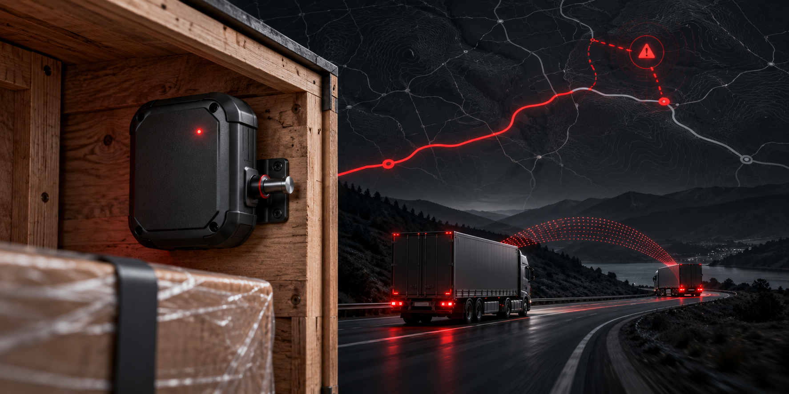
</p>
<p align="center"><sub>Product concept: a tracker watching cargo on the road, with route deviation and fleet relay shown around it. This is an illustration, not a photograph of a manufactured device.</sub></p>

<p align="center">
  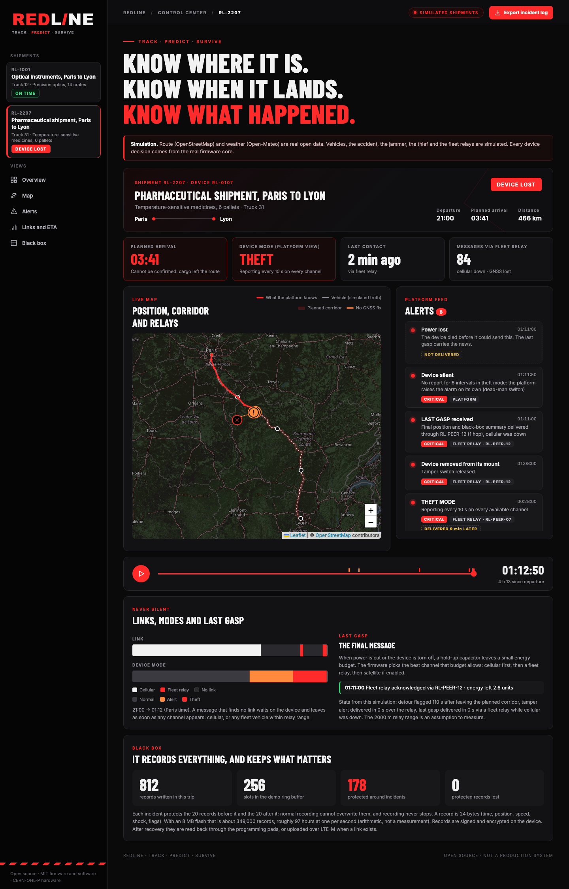
</p>
<p align="center"><sub>The control center replaying a simulated theft. The road and weather use open data; vehicles, theft events, and fleet relays are simulated. Device decisions come from the firmware core.</sub></p>

> **Successor of [TiltAlert](https://github.com/mouad-abaaqil/TiltAlert).** TiltAlert counts the shocks a parcel takes. Redline tells you where the whole shipment is, when it will arrive, whether it is still on its route, and what happened to it, even if nobody ever finds the device.

---

## 1. The problem: freight goes dark

A truck leaves Paris with six pallets of medicines. Somewhere near Auxerre it takes a road that is not on the plan. Twenty minutes later the cellular network drops. An hour after that the cargo is gone.

What the operator has at that point:

- **A promise, not a prediction.** The ETA was computed at departure. It knows nothing about the accident ahead or the fog that is already there.
- **A tracker that stops talking exactly when it matters.** Thieves jam GNSS and cellular, or just drive into a valley with no coverage.
- **No black box.** When the device is torn off and thrown away, everything it knew goes with it.
- **Tools you rent, with data you do not own.** The price is per device per month and the logic is a secret.

## 2. The solution: three promises, one device

### TRACK: exact position, and the discipline to notice when something is wrong

- **Position** from GNSS, reported every 15 minutes in normal mode, every 60 s in alert mode, every 10 s in theft mode.
- **Route corridor.** The planned route is loaded in the device with a corridor around it. Leaving it for 2 minutes raises an alert. This runs **on the device**, so it works with no network and the alert leaves as soon as any link appears.
- **Unauthorized stop.** Ten minutes still outside every authorized zone (depots, planned rest stops) is flagged. If GNSS is jammed, the accelerometer still says whether the vehicle moves.
- **Theft rules.** Movement while parked and armed, the device pulled off its mount (a spring plunger and a switch), the cover opened, the power cut, and GNSS lost *while the cellular link is healthy*, which points to a jammer. Each condition has a weight: a detour alone raises an alert, a tamper alone is theft.
- **Shock.** The shock sensor of TiltAlert (±200 g) stays, now feeding the black box.

### PREDICT: an arrival time that listens to the road

The engine ([`web/src/eta.js`](./web/src/eta.js), 8 unit tests) is pure and replayable. It combines:

| Input | Source | Cost |
| --- | --- | --- |
| Road network and free-flow speeds | [OpenStreetMap](https://www.openstreetmap.org/copyright), routed by [OSRM](https://project-osrm.org/) (Valhalla also supports per-hour speed profiles) | free |
| Traffic situations (accidents, roadworks) | National access points publishing [DATEX II](https://www.datex2.eu/), for example [transport.data.gouv.fr](https://transport.data.gouv.fr/) | free |
| Weather: rain, visibility, wind | [Open-Meteo](https://open-meteo.com/en/about) (CC BY 4.0, free for open source, self-hostable) | free |
| What the fleet actually measures | Speeds from the trackers themselves | free |
| Mandatory driver breaks | 45 min after 4.5 h of driving (rule to check per vehicle class) | free |

A traffic situation only counts **once it has been published**: the estimate never uses information that did not exist yet.

### SURVIVE: the device that never goes silent

- **Black box.** Every second: position, speed, shock, link state, tamper. In a ring buffer where the 20 records before and after each incident are **protected** from being overwritten. Recording never stops. Records are signed and encrypted.
- **Three communication layers.** Cellular LTE-M/NB-IoT first. When it is down, a **fleet relay**: the message hops through any Redline device in range, over DECT NR+ mesh, like Find My but for freight. Satellite NB-NTN is an option, off by default (it is the only paid layer).
- **Last gasp.** A hold-up supercapacitor leaves a small energy budget when the device is torn off or the supply is cut. The firmware spends it on the best channel available: cellular, then a fleet relay, then satellite.
- **Dead-man switch.** If the device stops reporting while in theft mode, the platform raises the alarm itself.

---

## 3. See it work

Two simulated shipments, Paris to Lyon (465 km, the real road, the real forecast). Open [`web/`](./web/) and replay them.

### Shipment 1: the arrival time that learns

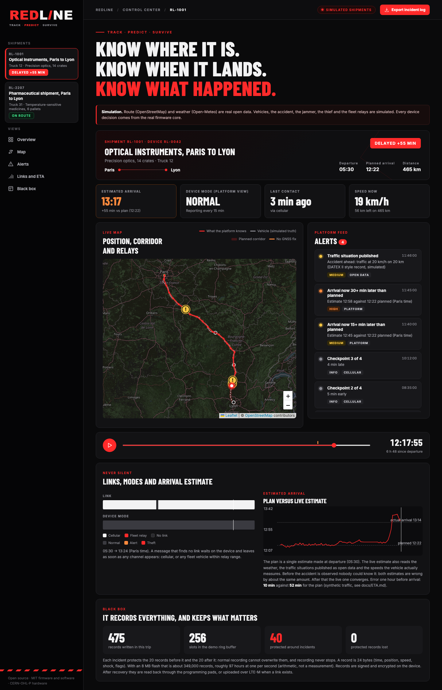

A truck leaves at 05:30 (Paris time) and the plan says it will arrive at 12:22. On the road it meets **real fog** (visibility down to 20 m on the forecast) and a **simulated accident** published at 11:46. It arrives at 13:14, **52 minutes late**.

| | Error on the arrival time |
| --- | --- |
| The plan made at departure | 52 min |
| Live estimate, 60 min before arrival | **10 min** |
| Live estimate, 15 min before arrival | **1 min** |

The live estimate cannot know about an accident before it is published: for the first hours it is as wrong as the plan. Once the situation is published and the truck slows down, it converges. The traffic pattern is synthetic, so these numbers show the mechanism, not a field result ([details](./docs/ETA.md)).

### Shipment 2: theft, jamming, and a last word through a stranger

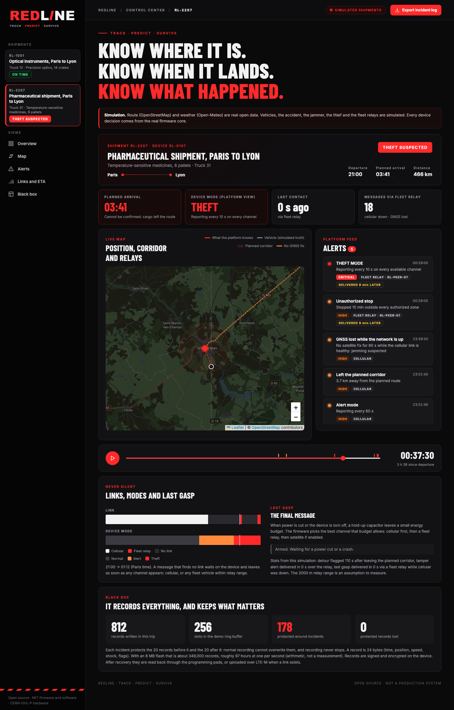

1. **21:31** The truck leaves the corridor. Alert delivered over cellular in about 2 minutes.
2. **21:39** GNSS lost while cellular is up: jamming suspected.
3. **22:28** The truck stops 10 minutes at an isolated site. Cellular is gone, so the **theft alert waits on the device for 9 minutes**, then goes through a passing fleet truck (RL-PEER-07).
4. **23:08** The device is torn off its mount. Tamper alert delivered **instantly** through another fleet truck.
5. **23:11** Power cut. The **last gasp** leaves in the same second over the fleet relay. The platform also raises a *device silent* alarm on its own.
6. Black box: 812 records, **178 protected** around the incidents, **0 lost**.

The 2 km relay range and the energy costs are **assumptions to measure on hardware**.

### The hardware, all components on one page

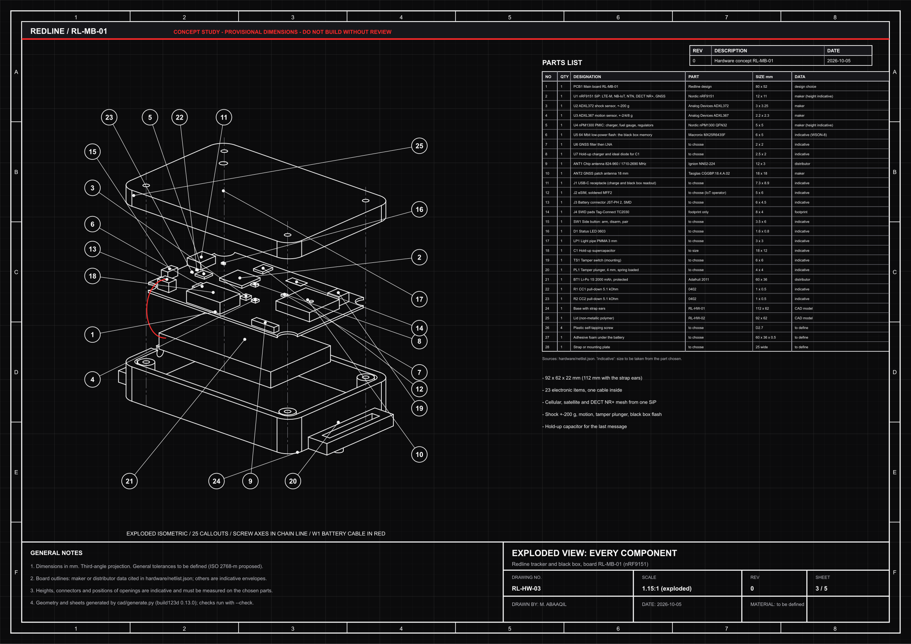

Five A3 sheets in a blackprint style, all generated from the 3D model and the netlist ([PDF, 5 pages](./docs/blueprints/redline-plans-A3.pdf)): general assembly with section, the board with the **tamper mechanism** in detail, the exploded view above, the electrical architecture, and the full wiring (33 nets, connector pin-outs, the one cable, power-up sequence).

<details>
<summary><strong>The other four sheets and the interface blueprint</strong></summary>

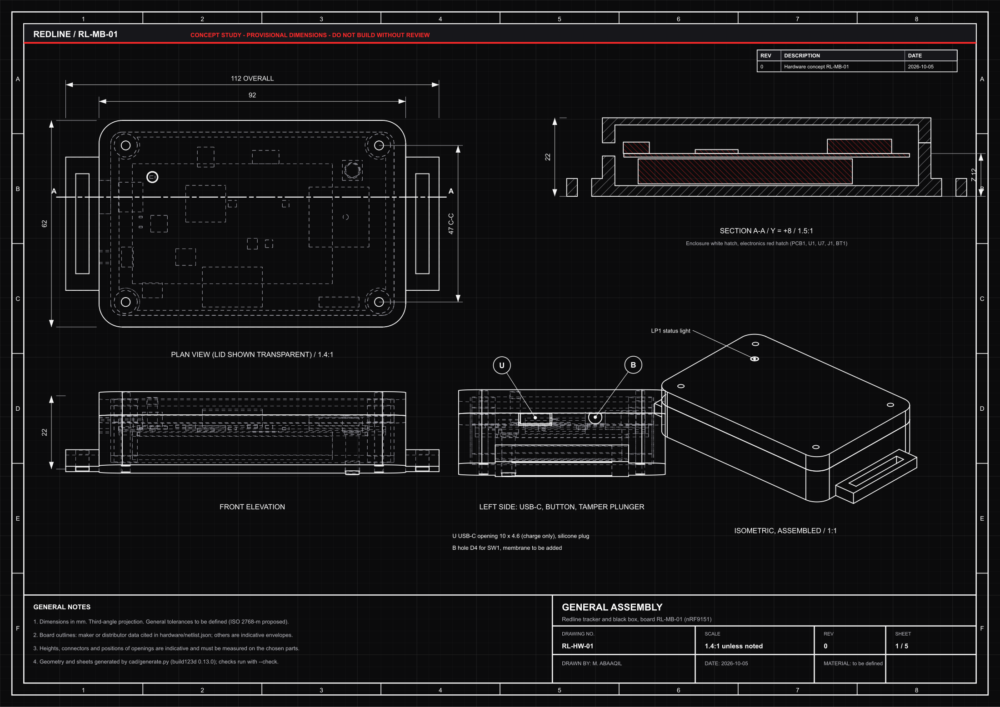

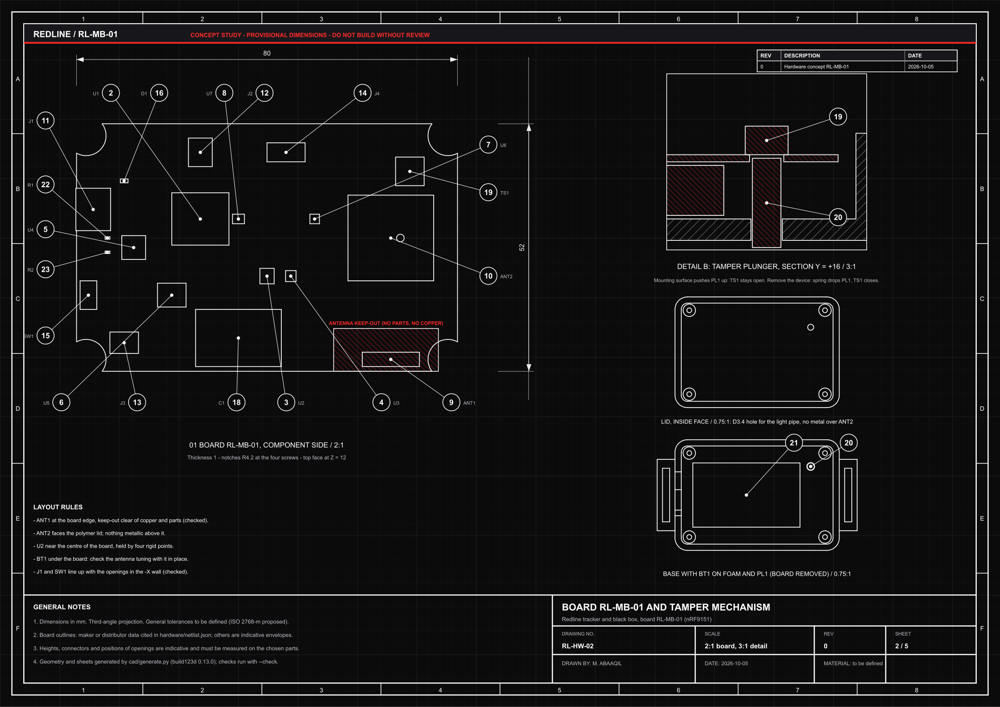

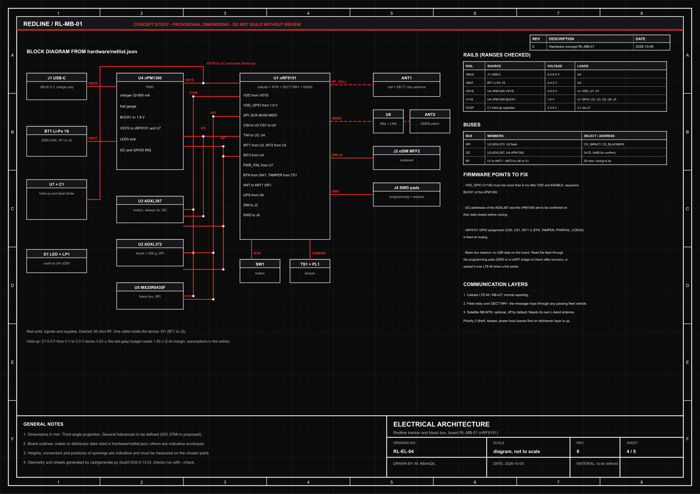

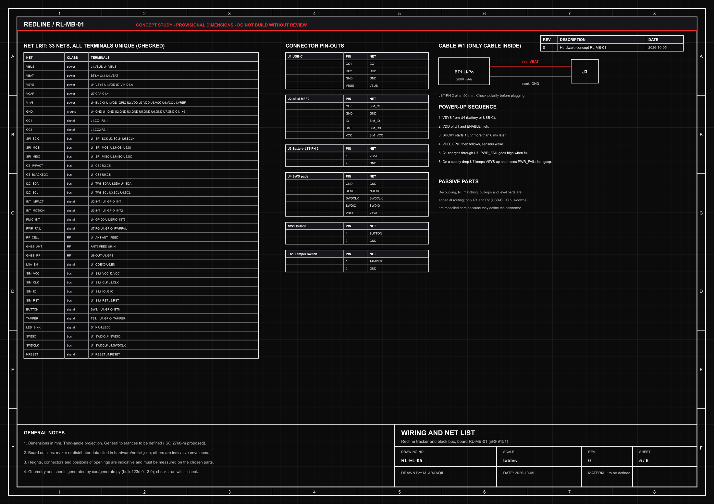

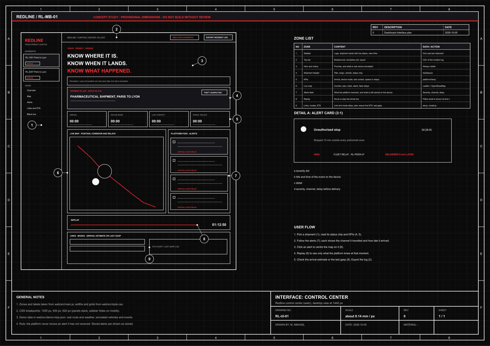

</details>

---

## 4. Under the hood

One custom board, **RL-MB-01**, in a 92 × 62 × 22 mm enclosure. Every part is in [`hardware/netlist.json`](./hardware/netlist.json) with its source.

| Function | Part | Why |
| --- | --- | --- |
| Brain, cellular, mesh, satellite, GNSS | [Nordic nRF9151](https://www.nordicsemi.com/products/nrf9151) | One SiP supports LTE-M, NB-IoT, [NB-NTN satellite](https://www.nordicsemi.com/products/nrf9151), DECT NR+ mesh and GNSS. |
| Shock, black box trigger | [ADXL372](https://www.analog.com/en/products/adxl372.html), ±200 g | Peak capture and FIFO for the pre-trigger waveform. |
| Motion, always on | [ADXL367](https://www.analog.com/en/products/adxl367.html) | Wakes the system, tells moving from still when GNSS is jammed. |
| Power | [nPM1300](https://www.nordicsemi.com/Products/nPM1300) | Charger, fuel gauge, regulators in one chip. |
| Black box memory | 64 Mbit low-power flash | About 349,000 records of 24 bytes, roughly 97 hours at 1 Hz (arithmetic, not a measurement). |
| Last gasp | Supercapacitor 0.5 F + hold-up charger | 3.5 J stored against 1.5 J needed (2.4×, assumptions in the netlist). |
| Tamper | Spring plunger + switch | The mounting surface holds the switch open; removal closes it. |
| Antennas | Chip antenna (cellular, DECT) + GNSS patch | Keep-out zone enforced in the model. The satellite layer needs its own L-band antenna. |

### A design that checks itself

Every time the drawings are generated, a script verifies that:

- all **23 parts fit** the enclosure without touching a wall, a screw boss or each other (≥ 0.2 mm);
- every **supply rail is inside the range** of every part it powers, and no rail is shorted to another;
- **SPI chip selects and I²C addresses** are distinct;
- the **antenna keep-out** is empty, and no part hangs over a screw notch of the board;
- the **USB-C and button openings** really cross the wall in front of their parts;
- the **hold-up capacitor stores at least twice** the energy the last-gasp budget needs.

### The firmware core is tested, not just written

[`firmware/RedlineCore.h`](./firmware/RedlineCore.h) is plain C++11 with no heap and no dependency, so the same code runs in the tests, in the simulation and on the device. `sh tests/run.sh` runs 9 test groups: geometry, route deviation with hysteresis, stops, schedule, jamming, theft rules, the black box ring buffer, the last-gasp channel choice, and the relay queue with priorities and duplicate protection.

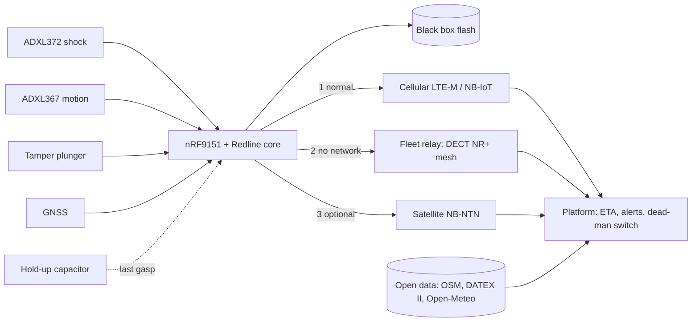

---

## 5. Honest status

| ✅ Proven in this repository | 🔬 To prove on real hardware |
| --- | --- |
| Core logic: deviation, stops, schedule, jamming, theft score, black box, last gasp, relay queue (tested C++). | Detection thresholds and false positives on real trucks. |
| ETA engine: breaks, rush hour, weather, published incidents, fleet correction (tested JS). | Accuracy on real traffic, against a measured weekly speed profile. |
| Two end-to-end simulated trips with real route and weather data, replayed in the dashboard. | Mesh range, relay behaviour in a moving fleet, DECT NR+ with real firmware. |
| Hardware checked by script: fit, rails, buses, keep-out, hold-up energy. | Antenna tuning with the battery in place, satellite layer, hold-up ESR during the LTE-M burst. |
| Plans, STEP and STL generated from the model. | Autonomy, enclosure test, transport of lithium cells (regulated). |

**Not claimed:** any accuracy, autonomy or cost figure. GNSS jamming detection is an aid, not a guarantee. A signature proves a log was not altered, not that a court accepts it. Satellite service in Europe depends on operators such as [Skylo](https://www.skylo.tech/newsroom/deutsche-telekom-murata-and-skylo-technologies-announce-satellites-nb-iot-ntn-early-adopter-program-for-europe) and costs money.

**Privacy.** Redline tracks **cargo, not people**. Using location data on a driver falls under labour law and the GDPR in Europe. See [`docs/PRIVACY_AND_ETHICS.md`](./docs/PRIVACY_AND_ETHICS.md): design rules, and what the system deliberately does not do.

### Next

1. Write the firmware on a [Nordic Thingy:91 X](https://docs.nordicsemi.com/r/bundle/ug_thingy91x/page/ug/thingy91x/intro/frontpage.html) (same SiP and PMIC): core logic, black box, LTE-M reporting.
2. Measure a weekly speed profile on a real corridor and replace the synthetic traffic pattern.
3. Test fleet relay range with two or three devices.
4. Route the PCB (4 layers), RF review, hold-up measurements.
5. Prototype the enclosure and test the tamper mechanism.

---

## 6. Explore the repository

| | |
| --- | --- |
| [`web/`](./web/) | Control center: live map, alerts with channel and delay, replay, ETA chart, last gasp, black box, CSV export. |
| [`firmware/RedlineCore.h`](./firmware/RedlineCore.h) | The device logic, tested. |
| [`simulation/`](./simulation/README.md) | Trip runner (links the real core), real route and weather snapshots, scenario generator. |
| [`hardware/`](./hardware/README.md) | Netlist, component choices, checks, points to settle before routing. |
| [`cad/`](./cad/README.md) | Parametric enclosure and the five A3 sheets (build123d). |
| [`docs/`](./docs/) | [Architecture](./docs/ARCHITECTURE.md) · [ETA](./docs/ETA.md) · [Mesh and last gasp](./docs/MESH_AND_LAST_GASP.md) · [Privacy and ethics](./docs/PRIVACY_AND_ETHICS.md) |
| [`branding/`](./branding/) | The logo files (SVG, generated). |

## 7. Run it

```bash
sh scripts/check.sh                 # all tests and checks (see below)

# Control center
cd web && npm ci && npm run dev     # then open the address Vite prints

# Regenerate the hardware drawings (Python 3.12, rsvg-convert)
python3.12 -m venv .venv && .venv/bin/pip install -r cad/requirements.txt
.venv/bin/python cad/generate.py            # sheets, STEP, STL
python3 docs/interface/generate.py          # interface blueprint

# Regenerate the simulated trips (only needs g++ and Node 20+)
node simulation/fetch-data.mjs              # optional: refresh the open-data snapshots
node simulation/make-scenario.mjs           # rebuilds web/src/demo-trips.json
```

`scripts/check.sh` runs the C++ tests, the web tests (ETA engine and dashboard model), the geometry and netlist checks, and rebuilds the dashboard.

## 8. Open source, for real

| | License |
| --- | --- |
| Firmware, software, simulation, drawings code | [MIT](./LICENSE) |
| Hardware design (netlist, enclosure model, plans) | [CERN-OHL-P v2](./LICENSE-HARDWARE.txt) (permissive) |
| Data | OpenStreetMap contributors (ODbL), Open-Meteo (CC BY 4.0). See [NOTICE](./NOTICE.md). |

---

<p align="center">
  <strong>REDLINE</strong> · Track · Predict · Survive<br>
  <sub>A concept with checked foundations, not a product. Dimensions and architecture are not validated for manufacture.</sub>
</p>
